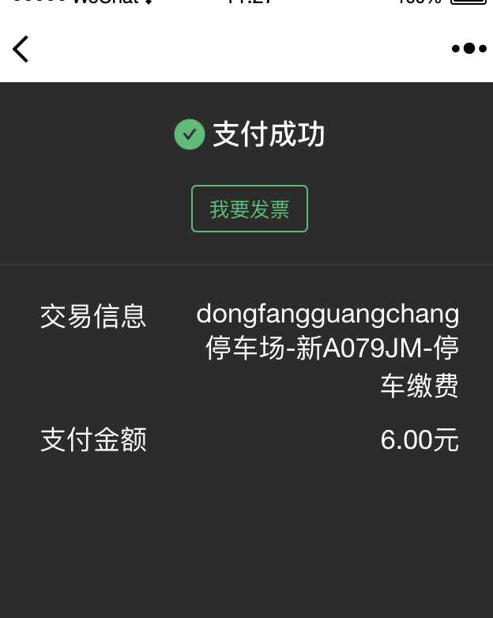

# 点金计划页面定制支持

定制按钮为`我要发票`, 需要在下单的时候在extra字段传入`receipt`字段：

```java
public void tradePrepare() throws APIRemoteException, IOException {
        Map<String, String> extra = new HashMap<>();
        extra.put("plate", "粤B11111");      // 缴费车牌
        extra.put("parking_time", "3600");  // 停车时长, 单位秒
        extra.put("enter_time", String.valueOf(System.currentTimeMillis()));    // 入场时间, 单位毫秒
        extra.put("park_name", "P云支付体验-停车场");   // 停车场名称
        extra.put("autopay", "1");  // 开启无感引导
        extra.put("receipt", "1");  // 点金计划完成页面显示按钮"我要发票"(固定传1)

        BaseRequest request = TradePrepareRequest.builder()
                .appId(appId)
                .merchant(merchant)
                .subject("停车缴费")
                .body("停车缴费详情")
                .payOrder(DateUtils.getNow("yyyyMMddHHmm"))
                .channel(ChannelCode.WeChatPayJSAPI)
                .value(1)
                .notifyUrl("https://4pyun.com/payment/sync")
                .callbackUrl("https://4pyun.com/payment/callback")
                .extra(objectMapper.writeValueAsString(extra))
                .build()
                .createSignature(appSecret);

        String body = this.doPost(UrlUtils.build(gateway, "/gate/1.0/payment/trade/prepare"), request.toMap());

        TradePrepareResponse response = objectMapper.readValue(body, TradePrepareResponse.class);
        System.out.println(response.getPayUrl());
        System.out.println(response.getPayId());
    }
```

