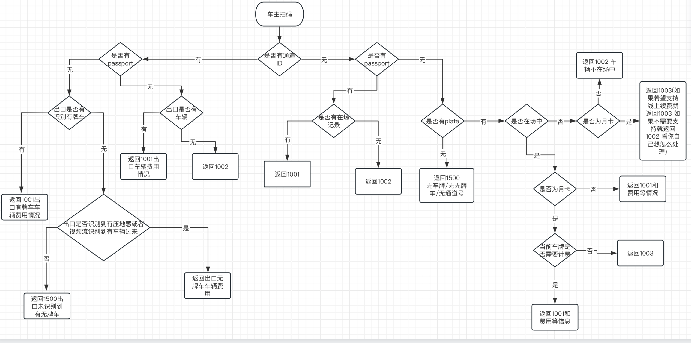

# 获取临停缴费订单

**协议说明:**

当用户在P云场时获取停车订单时, P云将发送该协议请求到停车场系统, 通过车牌号/停车卡ID获取停车支付订单;

**付费入场**

当付费入场当前接口传递参数`gate_id`对应车场系统通道类型为入口, 厂商自行判断是否允许付费入场, 若不允许直接返回没有订单或返回错误信息即可; 反之直接返回付费入场的费用。

- <p style="color:red">若为无牌车入场, 虚拟车牌会在支付结果同步时传递给车场系统。</p>
- <p style="color:red">若无牌车通道扫码没有压地感, 需要返回1500并在将原因设置到message中，不可返回1002。</p>
- <p style="color:red">若确认传入passport已经离场则必须返回1002状态码。</p>


**时段月卡/多车共位**

在多月共位/时段月卡的场景, 可返回`car_type`, 用于当非临时车辆时(`car_type!=1`), 前端可选择跳转固定车续费或直接缴临停费用。


**无牌车通道计费逻辑**

通道计费有以下情况
1. 如果客户有没有离场的无牌车记录通道计费会下发
`gate_id`+`passport`(无牌车虚拟车牌)
2. 没有有效无牌车记录计费下发
`gate_id`

建议本地软件在通道计费返回订单逻辑, 根据`gate_id`判断当前通道车辆信息有以下情况:
- 当前识别到有牌车，直接返回有牌车费用;
- 当识别到无牌车，检查传入参数`passport`根据`passport`返回停车费用;
- 当识别没有车辆，没有传入`passport`提示没有停车记录（result_code=1002）;
- 当识别没有车辆，传入`passport`, 并且`passport`没有停车中记录提示没有停车记录, 会自动标记无牌车状态已失效(result_code=1002);
- 当识别没有车辆，传入`passport`, 并且`passport`有停车中记录提示没有检测到无牌车, 防止系统自动清理无牌车状态)(esult_code=1500)。

**交互流程图**



**请求:**

| 字段 | 类型 | 必须 | 说明|
| --- | --- | --- | --- |
| service| string | Y | 服务名: `service.parking.payment.billing`|
| version| string | Y | 版本号:`1.0`|
| charset| string | Y | 字符集:`UTF-8`|
| sign | string | Y | 签名|

| 字段 | 类型 | 必须 | 说明|
| --- | --- | --- | --- |
|park_uuid | string | Y | 停车场编号, 由P云分配 |
|plate | string | N | 支付车牌号 |
|card_id | string | N | 支付停车卡物理ID |
| passport | string | N | 用户通行证ID, 无牌车传入 |
|gate_id | string | N | 通道编号ID, 无牌车付费时可传递触发开闸. |
|charge_type|string|N|指定收费规则, 前端直接透传到车场|

**注:** `card_id`, `plate` 和`passport`为互斥参数. 若传递`card_id`则停车场应该根据停车卡查询停车信息返回停车订单;若传递`plate`停车场应根据车牌号返回停车订单; 而passport则是P云为无牌车生成的一个唯一标识.

*请求示例*
```json
{
  "charset":"UTF-8",
  "park_uuid":"aaaaaaa-ec98-46be-89e3-26bca7be833e",
  "plate":"粤B660PP",
  "service":"service.parking.payment.billing",
  "version":"1.0"
}
```

**应答:**

| 字段 | 类型 | 必须 | 说明|
| --- | --- | --- | --- |
|service | string | Y | 服务名: `service.parking.payment.billing`|
| version| string | Y | 版本号:`1.0`|
| charset| string | Y | 字符集:`UTF-8`|
|result_code | string | Y | 状态码:<br/>值 含义<br/>1001  订单获取成功, 业务参数将返回.<br/>1002  未查询到停车信息.<br/>1003  固定车辆, 不允许支付(有效期内返回, 过期不返回此状态).<br/>1401  签名错误, 请检查配置.<br/>1500  接口处理异常, 例如: 通道获取订单没有监测到车辆、连接数据库失败等异常. |
|message | string | Y | 状态码处理描述, 如:返回错误信息.|
| sign | string | Y | 签名|

| 字段 | 类型 | 必须 | 说明|
| --- | --- | --- | --- |
| plate | string | N | 识别车牌号码.|
| card_id | string | N | 无牌车获取订单返回本地的虚拟卡ID/虚拟车牌.|
| **parking_serial** | string | Y | **<p style="color:red">停车流水, 标识具体某次停车事件, 需保证该停车场下唯一, 付费入场可不返回。和进出场上报`parking_serial`保持一致!!!</p>**|
| parking_order | string | Y | 停车支付订单号, 需保证该停车场下唯一.注:同一停车场内不可重复！|
| enter_time | string | Y | 入场时间, 格式`yyyyMMddHHmmss`.|
| parking_time | int | Y | 停车时长(单位秒)|
| total_value | int | Y | 总停车费用(单位分), 为用户从入场到现在获取订单时的总费用.|
| free_value | int | Y | 已优惠金额(单位分), 为停车场在当前停车费用时已经给予的优惠金额, 如果包涵优惠时间则该值为则free_value填写该时间等价的优惠金额+其他有效优惠金额.|
| paid_value | int | Y | 已支付金额(单位分), 为当次停车用户已经支付的金额, 比如当用户先支付了一笔后, 超时未出场重新查询订单时须返回以支付金额.|
| pay_value | int | Y | 应支付金额(单位分), 这里停车场系统需处理如果结果为负数的情况直接返回无需支付.|
| enter_free_time | int | N | 入场免费时间(单位秒)|
| buffer_time | int | N | 当前系统预留出场时间(单位秒)|
| parking_number | string | N | 车辆所在位置信息, 例如: B660.|
| pay_type | int | N | 付费类型: 6 付费入场, 其他无效 |
| car_type | int | N | 车型:<br/>1.临停车辆<br/>2.非临时车 |
| car_desc | string | N | 车型类型说明 |
| recharge_expire_days | int | N | 允许过期续费天数: <br/>`<0` 不支持月卡续费<br/>`=0` 支持月卡续费不支持过期续费<br/>`>0`表示允许过期x天续费<br/>`=7`表示允许过期7天内续费|
| plate_type | int | N | 车牌类型: 0-中国大陆车牌, 1-境外车牌(含港澳), 2-两轮电动车车牌 |
| plate_color | int | N | 车牌颜色: 1.蓝色, 2.黄色, 3.白色, 4.黑色, 5.绿色, -1 未知 |

*应答示例*
```json
{
  "buffer_time":"1320",
  "charset":"UTF-8",
  "enter_free_time":"1860",
  "enter_time":"20181130100904",
  "free_value":"0",
  "paid_value":"0",
  "parking_order":"2018113010535820181130100904034792608",
  "parking_serial":"20181130100904034792608",
  "parking_time":"2694",
  "pay_value":"500",
  "plate":"粤B660PP",
  "result_code":"1001",
  "service":"service.parking.payment.billing",
  "sign":"73DF19DA361CB673DD3FEFC7A6135BE6",
  "total_value":"500",
  "version":"1.0"
}
```
