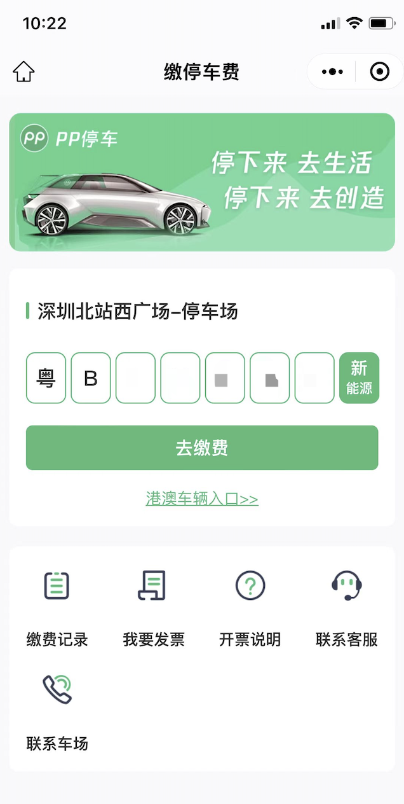
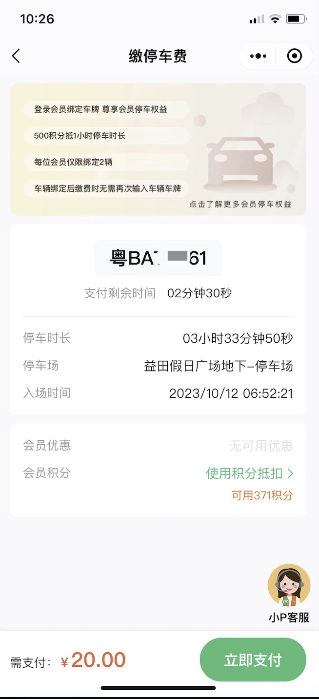

# 接入PP停车小程序

    小程序跳转PP停车小程序实现停车缴费，支持多种场景跳转。

## 1. 跳转停车场预付页面

**跳转参数**

|参数|必须|说明|
|---|---|---|
|park_uuid|Y|停车场UUID, P云平台创建车场后获取。|
|plate|N|默认缴费车牌, 传递后页面默认填入该车牌。|

**示例:**

```js
if (wx.openEmbeddedMiniProgram) {
   wx.openEmbeddedMiniProgram({
     appId: 'wxa204074068ad40ef',
     path: '/parking/billing/plate/index?park_uuid=0a4b97af-6900-421a-98fc-64ea0519f2c8'
   })
 } else {
   wx.navigateToMiniProgram({
     appId: 'wxa204074068ad40ef,
     path: '/parking/billing/plate/index?park_uuid=0a4b97af-6900-421a-98fc-64ea0519f2c8'
   })
 }
```

**演示:**



## 2. 跳转缴费页面

**跳转参数**

|参数|必须|说明|
|---|---|---|
|park_uuid|Y|停车场UUID, P云平台创建车场后获取。|
|plate|N|通过车牌号码获取订单|

**示例:**
```js
if (wx.openEmbeddedMiniProgram) {
   wx.openEmbeddedMiniProgram({
     appId: 'wxa204074068ad40ef',
     path: '/parking/billing/payment/index?park_uuid=0a4b97af-6900-421a-98fc-64ea0519f2c8&plate=XXX'
   })
 } else {
   wx.navigateToMiniProgram({
     appId: 'wxa204074068ad40ef,
     path: '/parking/billing/payment/index?park_uuid=0a4b97af-6900-421a-98fc-64ea0519f2c8&plate=XXX'
   })
 }
```

**演示:**


