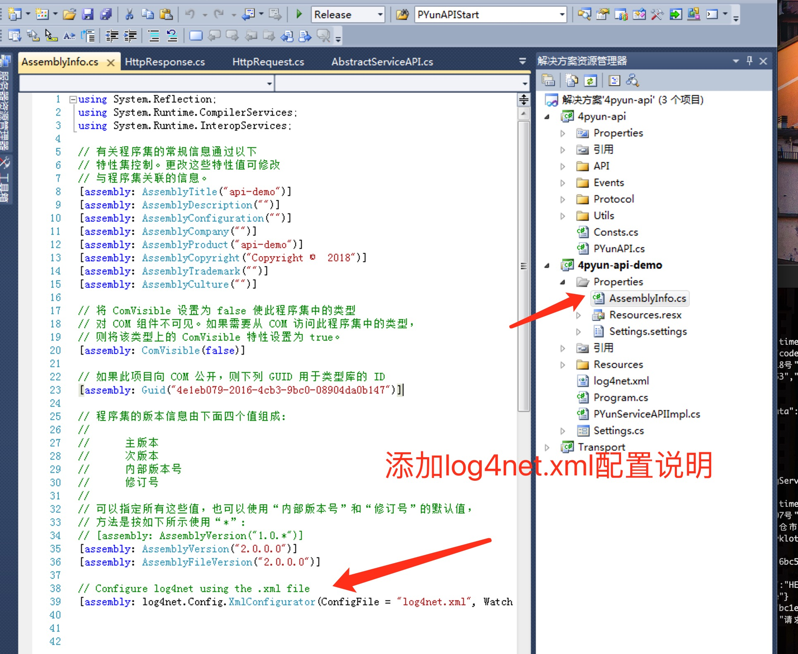
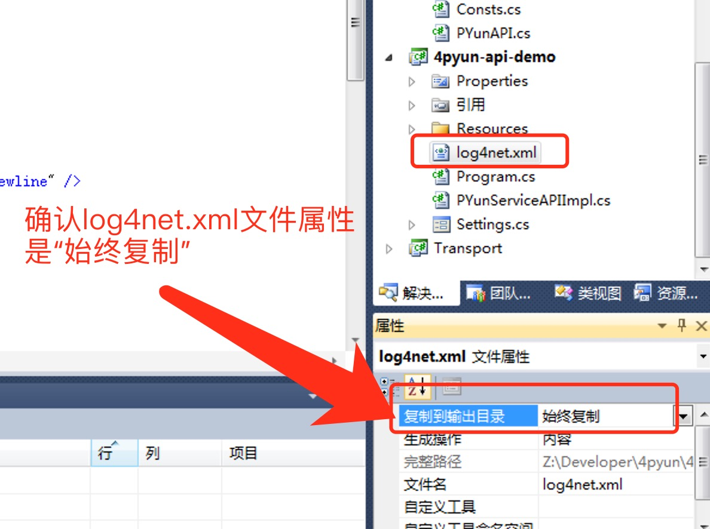
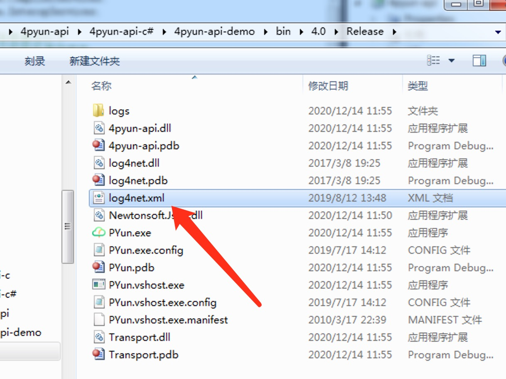
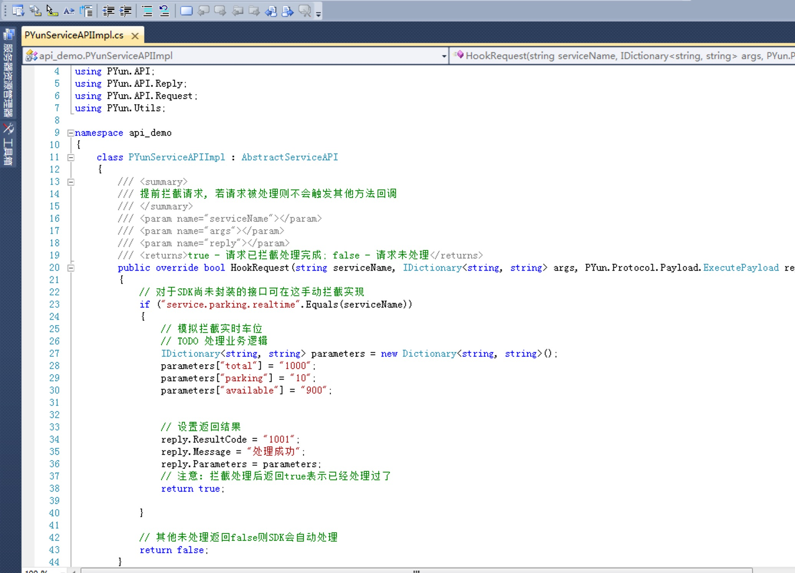

# C-Sharp SDK接入说明

一、设置SDK日志
1. 工程添加设置

2. 程序目录添加log4net.xml配置文件，log4net.xml需要发布到代码目录

还是没有日志在main函数第一行添加
log4net.Config.XmlConfigurator.Configure();

二、协议处理
SDK设置了一些默认方法实现，但由于协议文档变化，SDK不能及时根据协议文档调整字段，建议开发者直接解析协议请求和返回参数，具体可通过重写HookRequest直接拦截并处理下行请求服务。

